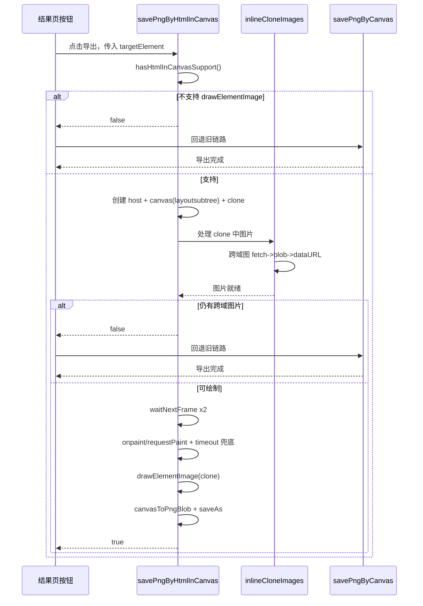

# screenshot.ts 实现说明（更新版）

## 1. 设计目标

`src/utils/screenshot.ts` 负责“结果页导出 PNG”能力。当前采用双链路设计：

- **新链路**：`html-in-canvas`（优先执行，追求更接近真实 DOM 的渲染）
- **旧链路**：`dom-to-image + OffscreenCanvas`（稳定兜底）

核心原则：

1. 能用新链路就用新链路；
2. 新链路任何关键步骤失败时返回 `false`，由上层回退旧链路；
3. 不让用户在失败时拿到空白或严重错位图片。

## 2. 对外导出 API

- `isApple()`  
  识别 iOS / Safari 环境，主要给旧链路做时序兼容。

- `savePngByHtmlInCanvas(targetElement?: HTMLElement)`  
  新截图链路。成功返回 `true`，失败返回 `false`（不抛给页面，交由上层决定是否回退）。

- `savePngByCanvas(isDown?: boolean)`  
  旧截图链路，兼容保底方案。

## 3. 常量与类型说明

### 3.1 常量

- `EXPORT_FILENAME`：导出文件名（`Arknights.png`）
- `HTML_IN_CANVAS_SCALE`：新链路超采样倍率（当前 `3`）
- `HTML_IN_CANVAS_TIMEOUT_MS`：`paint` 事件兜底触发等待（当前 `240ms`）
- `IMAGE_READY_TIMEOUT_MS`：克隆图加载超时时间（当前 `4000ms`）
- `IMAGE_DATA_URL_CACHE`：远程图转 `data:` 缓存（内存级）

### 3.2 扩展类型

- `Canvas2DWithDrawElementImage`：给 `2d context` 增加 `drawElementImage`
- `HtmlInCanvasElement`：给 `canvas` 增加 `layoutSubtree / onpaint / requestPaint`

这些类型仅用于适配实验 API 的 TS 声明，不改变运行时行为。

## 4. 新链路实现细节（`savePngByHtmlInCanvas`）

### 4.1 能力门禁

通过 `hasHtmlInCanvasSupport()` 检测 `drawElementImage` 是否存在：

- 不存在：立即 `return false`
- 存在：继续执行

### 4.2 尺寸计算与离屏节点创建

1. 从 `targetElement` 读取宽高（优先 `getBoundingClientRect`，回退 `clientWidth/Height`）。
2. 创建离屏容器 `host`（不可见、不可交互）。
3. 创建 `<canvas layoutsubtree>` 并设置：
   - CSS 尺寸 = 目标尺寸
   - 像素尺寸 = 目标尺寸 * `HTML_IN_CANVAS_SCALE`
4. 深拷贝目标节点得到 `clone` 并挂入 canvas。

### 4.3 样式一致性修正（新增）

为解决“标题居中在导出图中偏移”的问题，新增两层处理：

1. **挂载上下文修正**  
   不再固定挂到 `document.body`，而是挂到 `targetElement.parentElement`（无父节点才回退 `body`）。  
   目的：让离屏树处于和原节点更接近的继承上下文中。

2. **继承文本样式补齐**  
   将 `targetElement` 的关键计算样式写回 `clone` 根节点：
   - `textAlign`
   - `color`
   - `fontFamily`
   - `fontSize`
   - `fontWeight`
   - `lineHeight`
   - `letterSpacing`

这一步主要避免文本对齐和排版在克隆树中发生漂移。

### 4.4 跨域图片空白修正

`html-in-canvas` 对跨域敏感内容会做保护，直接绘制可能出现图片空白。  
处理逻辑在 `inlineCloneImages(sourceRoot, cloneRoot)`：

1. 按 DOM 顺序匹配源图与克隆图；
2. 对跨域 `http(s)` 图片执行 `fetch -> blob -> FileReader -> data URL`；
3. 替换克隆图 `src`，并移除 `srcset`；
4. 等待每个图片节点就绪（`load / error / timeout`）；
5. 若最终仍检测到跨域 URL（`hasCrossOriginImages`），返回 `false` 触发上层回退。

补充：`IMAGE_DATA_URL_CACHE` 可避免同一 URL 重复转换。

### 4.5 绘制时序控制

1. 连续 `waitNextFrame()` 两次，确保离屏树布局稳定；
2. 监听 `canvas.onpaint` 并尝试 `canvas.requestPaint()`；
3. 同时设置 `setTimeout(draw, HTML_IN_CANVAS_TIMEOUT_MS)` 作为兜底；
4. 在 `draw()` 中执行：
   - `setTransform(1,0,0,1,0,0)` 重置矩阵
   - 清空画布并填充背景（跟随深浅色）
   - 按超采样倍率 `scale`
   - `drawElementImage(clone, 0, 0, targetWidth, targetHeight)`

### 4.6 导出与资源回收

- 用 `canvasToPngBlob` 转 PNG
- `saveAs(blob, EXPORT_FILENAME)` 下载
- `finally` 清理：
  - `canvas.onpaint = null`
  - `host.remove()`

## 5. 旧链路实现细节（`savePngByCanvas`）

旧链路流程：

1. `domtoimage.toSvg(document.body)` 生成 SVG；
2. `Image` 加载 SVG；
3. 绘制到 `OffscreenCanvas`；
4. 导出 PNG。

苹果环境兼容：

- `isApple()` 下使用多帧等待（`waitFrames(5, ...)`）后再最终下载，规避 Safari 时序问题。

## 6. 失败路径与回退策略

`savePngByHtmlInCanvas` 在以下场景返回 `false`：

- 浏览器不支持 `drawElementImage`
- 获取 2D context 后不具备实验方法
- 跨域图片内联后仍存在跨域图片
- 绘制流程出现异常

上层推荐固定写法：

1. `const ok = await savePngByHtmlInCanvas(target)`
2. `if (!ok) await savePngByCanvas(...)`

## 7. 当前限制与后续优化

### 7.1 已知限制

- 新链路依赖实验特性，浏览器支持度有限；
- 远程图片转 `data:` 会增加瞬时内存压力；
- 页面图片非常多时，转换耗时会明显上升。

### 7.2 可继续优化项

- 增加策略开关（强制新链路 / 强制旧链路）；
- 给 `fetch` 增加并发上限与重试策略；
- 记录失败 URL 与失败原因，便于定位兼容性问题；
- 可选加入链路耗时埋点（能力检测、图片转换、绘制、导出）。

## 8. 调用时序图（Mermaid）

